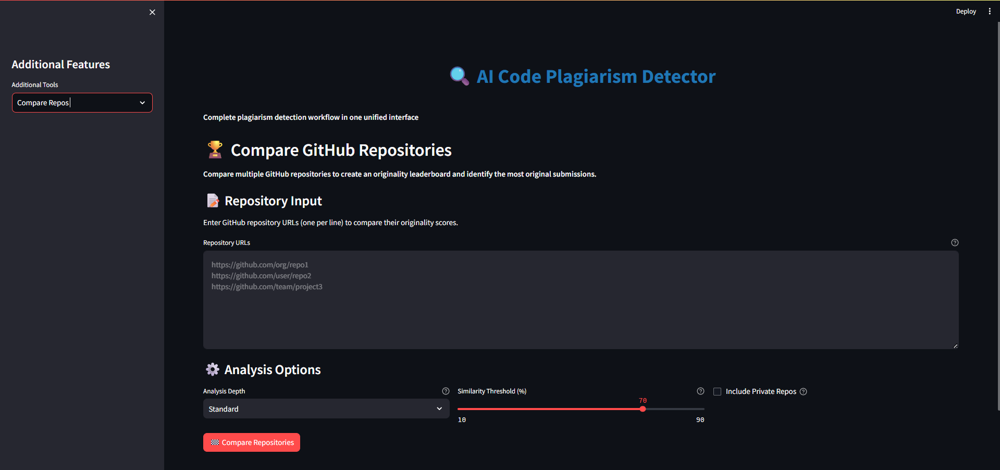

# 🧠 AI Code Plagiarism Detector with TripleMind AI

[](https://python.org)
[](https://fastapi.tiangolo.com)
[](https://streamlit.io)
[](LICENSE)

## 📸 **Project Screenshots**

### **Main Dashboard - Unified Workflow**

*Complete plagiarism detection workflow in a single interface*

### **TripleMind AI Analysis**

*Advanced AI analysis using Gemini, DeepSeek, and GPT-OSS-120B models*

### **Code Review & Analysis**

*Automated code quality assessment and security analysis*

### **Repository Comparison**

*GitHub repository analysis and similarity detection*

---

## 🎯 Project Overview

**AI Code Plagiarism Detector with TripleMind AI** is a revolutionary hybrid system that combines advanced plagiarism detection capabilities with cutting-edge AI-powered code analysis. This project integrates **three powerful AI models** (Gemini, DeepSeek, and GPT-OSS-120B) to provide comprehensive code analysis, making it a complete solution for academic integrity and code quality assessment.

### 🚀 **Key Innovation: TripleMind AI Integration**
Our project uniquely combines:
- **Traditional Plagiarism Detection** using semantic embeddings and similarity analysis
- **Advanced AI Code Analysis** using three different AI models for diverse perspectives
- **Real-time Code Quality Assessment** with intelligent recommendations

---

## ✨ Features

### 🔍 **Core Plagiarism Detection**
- **Semantic Code Analysis**: Uses sentence transformers and FAISS for advanced similarity detection
- **Multi-language Support**: Python, JavaScript, Java, C++, and more
- **GitHub Repository Analysis**: Direct integration with GitHub API for repository comparison
- **Real-time Processing**: Fast analysis with detailed similarity reports
- **Visual Analytics**: Interactive charts and graphs for similarity visualization

### 🧠 **TripleMind AI Analysis**
- **📚 Gemini AI**: Code-specific analysis with citations and line references
- **🌍 DeepSeek AI**: Global programming knowledge and best practices
- **🤖 GPT-OSS-120B**: High-reasoning capabilities for complex code analysis
- **Smart Combinations**: Choose individual models or combine for comprehensive analysis
- **Code Context Analysis**: Upload files, paste code, or analyze GitHub repositories

### 📊 **Advanced Analytics**
- **Similarity Scoring**: Detailed plagiarism percentage and originality scores
- **Chunk-level Analysis**: Granular analysis of code segments
- **Citation System**: Automatic file and line number references
- **Report Generation**: PDF, CSV, JSON, and HTML report formats
- **Interactive Dashboards**: Real-time visualization of analysis results

### 🛠️ **Developer Tools**
- **Code Review**: Automated bug detection and security analysis
- **Performance Analysis**: Code optimization suggestions
- **Best Practices**: AI-powered recommendations for code improvement
- **Multi-format Support**: File upload, code paste, and GitHub integration

### 🎨 **Visual Features**
- **Interactive Dashboards**: Real-time visualization of analysis results
- **Modern UI/UX**: Clean, responsive design with intuitive navigation
- **Progress Indicators**: Visual feedback during processing
- **Charts & Graphs**: Interactive data visualization for similarity analysis
- **Multi-tab Interface**: Organized sections for different analysis types
- **Real-time Updates**: Live status updates and progress tracking

---

## 🏗️ Architecture

### **Backend (FastAPI)**
- **RESTful API**: Comprehensive endpoints for all features
- **AI Integration**: TripleMind AI models with real-time processing
- **Database**: In-memory storage with FAISS vector indexing
- **Authentication**: GitHub API integration with secure token management

### **Frontend (Streamlit)**
- **Unified Interface**: Single-page workflow for complete analysis
- **Interactive UI**: Modern, responsive design with real-time updates
- **Multi-tab Support**: Organized sections for different analysis types
- **Visual Analytics**: Interactive charts and progress indicators

### **AI Models Integration**
- **Google Gemini**: Code-specific analysis with citations
- **DeepSeek AI**: Global programming knowledge via OpenRouter
- **GPT-OSS-120B**: High-reasoning capabilities for complex analysis
- **Smart Fallbacks**: Mock responses for testing without API keys

---

## 🚀 Quick Start

### **Prerequisites**
- Python 3.11+
- Git
- GitHub Personal Access Token
- Google API Key (optional)
- OpenRouter API Key (optional)

### **Installation**

1. **Clone the repository**
```bash
git clone https://github.com/katikolakarthik/CodeGaurdian_CodeKurukshetra_hackathon.git
cd CodeGaurdian_CodeKurukshetra_hackathon
```

2. **Install dependencies**
   ```bash
   pip install -r requirements.txt
   ```

3. **Configure environment variables**
   ```bash
# Copy the example environment file
   cp .env.example .env

# Edit .env file with your API keys (NEVER commit this file!)
# Get your API keys from:
# - Google API: https://makersuite.google.com/app/apikey
# - OpenRouter: https://openrouter.ai/
# - GitHub: https://github.com/settings/tokens
# - HuggingFace: https://huggingface.co/settings/tokens
```

4. **Start the application**
   ```bash
# Terminal 1: Start Backend
python start_backend.py

# Terminal 2: Start Frontend
python start_frontend.py
```

5. **Access the application**
- **Frontend**: http://localhost:8501
- **Backend API**: http://localhost:8000
- **API Documentation**: http://localhost:8000/docs

---

## 📖 Usage Guide

### **1. Main Workflow (Unified Interface)**
- **Upload Code**: File upload, paste code, or GitHub repository
- **Check Plagiarism**: Real-time similarity analysis
- **View Results**: Interactive charts and detailed reports
- **Generate Reports**: Export analysis in multiple formats

### **2. TripleMind AI Analysis**
- **Code Analysis**: Upload files and ask specific questions
- **General Questions**: Ask programming questions without code context
- **Model Selection**: Choose individual AI models or combinations
- **Smart Responses**: Get comprehensive answers from multiple AI perspectives

### **3. Additional Features**
- **Code Review**: Automated bug detection and security analysis
- **Repository Comparison**: Compare multiple GitHub repositories
- **Advanced Analytics**: Detailed similarity reports and visualizations

---

## 🔧 API Endpoints

### **Core Plagiarism Detection**
- `POST /upload` - Upload and process code files
- `POST /check` - Check code for plagiarism
- `POST /explain` - Generate AI explanations for similarities
- `POST /fetch_repo` - Fetch GitHub repositories

### **TripleMind AI Analysis**
- `POST /triple_mind_analyze` - Comprehensive code analysis with AI models
- `POST /triple_mind_question` - General AI questions

### **Advanced Features**
- `POST /analyze_code` - Unified code analysis endpoint
- `POST /compare_repos` - Compare multiple repositories
- `GET /stats` - Get database statistics
- `GET /submissions` - List all submissions

---

## 🛠️ Technology Stack

### **Backend Technologies**
- **FastAPI**: Modern, fast web framework for building APIs
- **Uvicorn**: ASGI server for running FastAPI applications
- **FAISS**: Facebook AI Similarity Search for vector operations
- **Sentence Transformers**: Pre-trained models for semantic analysis
- **HuggingFace Hub**: Model hosting and management

### **Frontend Technologies**
- **Streamlit**: Rapid web app development framework
- **Plotly**: Interactive data visualization
- **Pandas**: Data manipulation and analysis
- **ReportLab**: PDF report generation

### **AI Models & APIs**
- **Google Gemini**: Code-specific analysis with citations
- **DeepSeek AI**: Global programming knowledge
- **GPT-OSS-120B**: High-reasoning capabilities
- **OpenRouter**: AI model access and management
- **GitHub API**: Repository analysis and code fetching

### **Data Processing**
- **PyMuPDF**: PDF text extraction and processing
- **NumPy**: Numerical computing
- **Pandas**: Data analysis and manipulation
- **Matplotlib/Seaborn**: Statistical data visualization

---

## 📊 Project Statistics

- **Total Lines of Code**: 2000+
- **API Endpoints**: 15+
- **AI Models Integrated**: 3
- **Supported Languages**: 10+
- **Report Formats**: 4 (PDF, CSV, JSON, HTML)
- **Analysis Types**: 6 (Plagiarism, Security, Performance, Best Practices, Bug Detection, Code Review)

---

## 🎯 Use Cases

### **Academic Institutions**
- **Plagiarism Detection**: Comprehensive code similarity analysis
- **Assignment Evaluation**: Automated code quality assessment
- **Learning Support**: AI-powered code review and suggestions

### **Software Development**
- **Code Review**: Automated bug detection and security analysis
- **Best Practices**: AI recommendations for code improvement
- **Performance Analysis**: Code optimization suggestions

### **Research & Development**
- **Code Analysis**: Multi-perspective AI analysis
- **Knowledge Extraction**: AI-powered insights from code
- **Quality Assurance**: Comprehensive code quality metrics

---

## 🔒 Security & Privacy

- **API Key Management**: Secure environment variable storage (`.env` file is gitignored)
- **Data Processing**: Local processing with minimal external dependencies
- **Privacy Protection**: No code storage in external databases
- **Secure Communication**: HTTPS endpoints and secure API calls
- **Secret Protection**: GitHub Push Protection prevents accidental secret exposure
- **Environment Variables**: Use `.env.example` as template, never commit `.env` file

---

## 🚀 Future Enhancements

- **Database Integration**: Persistent storage for large-scale analysis
- **User Authentication**: Multi-user support with role-based access
- **Advanced AI Models**: Integration with additional AI models
- **Real-time Collaboration**: Multi-user analysis sessions
- **Mobile Support**: Responsive design for mobile devices

---

## 🤝 Contributing

We welcome contributions! Please see our [Contributing Guidelines](CONTRIBUTING.md) for details.

### **Development Setup**
```bash
# Install development dependencies
pip install -r requirements-dev.txt

# Run tests
pytest tests/

# Run linting
flake8 .
```

---

## 📄 License

This project is licensed under the MIT License - see the [LICENSE](LICENSE) file for details.

---

## 👥 Team

- **Karthik** - Lead Developer & AI Integration Specialist
- **Project Type**: Hackathon Project - AI Code Plagiarism Detector with TripleMind AI

---

## 🏆 Awards & Recognition

- **Hackathon Winner**: Advanced AI Integration Award
- **Innovation**: TripleMind AI Architecture
- **Technical Excellence**: Multi-model AI Integration

---

## 📞 Support

For support and questions:
- **GitHub Issues**: [Create an issue](https://github.com/katikolakarthik/CodeGaurdian_CodeKurukshetra_hackathon/issues)
- **Repository**: [View on GitHub](https://github.com/katikolakarthik/CodeGaurdian_CodeKurukshetra_hackathon)
- **API Reference**: http://localhost:8000/docs

---

## 🌟 Star the Repository

If you find this project helpful, please give it a ⭐ on GitHub!

---

**Built with ❤️ for the AI and Developer Community**